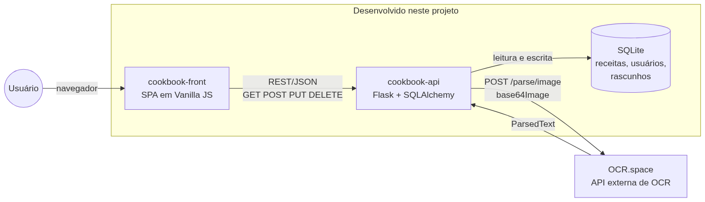
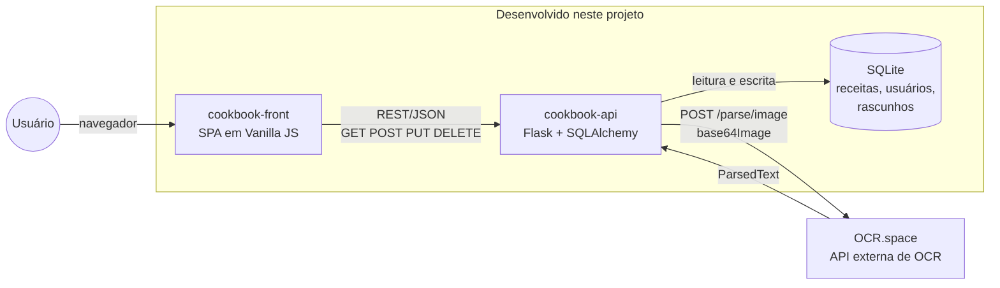

# Cookbook API

API HTTP da aplicação Cookbook: cadastro de usuários, autenticação, receitas (públicas, privadas e descoberta) e rascunhos importados a partir da foto de uma receita.

O front-end que consome esta API está no repositório `cookbook-front`.

## Arquitetura



O mesmo diagrama em mermaid (fonte também em `docs/arquitetura.mmd`):



O front nunca fala com o OCR.space: a chamada sai da API, que guarda a chave fora do navegador e devolve o resultado já como rascunho.

> **Importação por foto precisa de uma chave do OCR.space.** Sem ela, todo o resto funciona, mas o botão **Enviar arquivo** do front responde com erro (`POST /drafts/` devolve 502 com `OCR_NOT_CONFIGURED`). A chave é gratuita: crie uma em https://ocr.space/ocrapi, copie `.env.example` para `.env` na raiz deste repositório e coloque a chave em `OCR_SPACE_API_KEY` antes de subir a API.

## Dependências

- Python 3.12 (ou 3.10+)
- Pacotes em `requirements.txt` (Flask, Flask-SQLAlchemy, Flask-CORS, Pydantic, argon2-cffi, requests)
- Uma chave gratuita do OCR.space, necessária apenas para a importação por foto

## Variáveis de ambiente

Copie `.env.example` para `.env` e preencha:

| Variável | Obrigatória | Uso |
| --- | --- | --- |
| `OCR_SPACE_API_KEY` | Para importar por foto | Chave do OCR.space. Sem ela, `POST /drafts/` responde 502 com `OCR_NOT_CONFIGURED`. |
| `DATABASE_URL` | Não | URL do banco. Vazia, usa SQLite em `instance/app.sqlite`. |
| `MAX_UPLOAD_BYTES` | Não | Tamanho máximo do arquivo enviado. Padrão `1048576` (1 MiB, limite do plano gratuito do OCR.space). |

O `.env` não é versionado.

## Executar

### Localmente

Na raiz do repositório (`cookbook-api`):

```bash
python3 -m venv .venv
source .venv/bin/activate
pip install -r requirements.txt
```

Carregue as variáveis e suba o Flask (sempre na raiz do repositório, com o `PYTHONPATH` apontando para `src`):

```bash
set -a && source .env && set +a
export PYTHONPATH=src
flask --app app.app run --debug
```

No Windows, ao ativar a venv use `.venv\Scripts\activate` em vez de `source .venv/bin/activate`.

### Dados de exemplo

Para a aplicação não abrir vazia:

```bash
PYTHONPATH=src flask --app app.app seed
```

O comando cria dois usuários com receitas públicas e privadas e pode ser executado mais de uma vez sem duplicar nada:

| Usuário | E-mail | Senha |
| --- | --- | --- |
| Vó Maria | `maria@cookbook.dev` | `cookbook123` |
| Chef Joao | `joao@cookbook.dev` | `cookbook123` |

### Com Docker

Este repositório tem o `docker-compose.yml` que sobe a API e o front juntos. Os dois repositórios precisam estar lado a lado:

```text
workstation/
├── cookbook-api/
└── cookbook-front/
```

Na raiz de `cookbook-api`, com o `.env` preenchido:

```bash
docker compose up --build
```

O comando é `docker compose`, com espaço (Compose v2). O antigo `docker-compose`, com hífen, foi descontinuado e costuma não estar instalado.

No Linux, o Docker só aceita comandos de root ou de quem está no grupo `docker`. Sem o grupo, use `sudo docker compose up --build`. No Windows e no Mac, o Docker Desktop dispensa os dois.

- Front: http://127.0.0.1:8080
- API: http://127.0.0.1:5000
- Swagger: http://127.0.0.1:5000/docs

O container da API roda o `seed` antes de subir. O banco fica no volume `api-data` e sobrevive a `docker compose down`; para zerar, use `docker compose down -v`.

## Documentação das rotas

Swagger UI em **http://127.0.0.1:5000/docs**. O JSON OpenAPI está em **/openapi.json**.

Rotas que identificam o usuário leem o header `user-id`, preenchido pelo front com o id devolvido no login.

| Recurso | Rotas |
| --- | --- |
| Autenticação | `POST /auth/` |
| Usuários | `GET POST /users/`, `GET DELETE /users/<id>`, `PATCH /users/<id>/change-name`, `PATCH /users/<id>/change-password` |
| Receitas | `GET POST /recipes/`, `GET /recipes/discover`, `GET /recipes/author/<id>`, `POST /recipes/save`, `GET PUT DELETE /recipes/<id>` |
| Rascunhos | `GET POST /drafts/`, `GET /drafts/author/<id>`, `GET PUT DELETE /drafts/<id>` |

### Erros de validação

Dados inválidos respondem 422 com as mensagens em português, uma por campo:

```json
{
  "error": "validation_error",
  "message": "Título: máximo de 40 caracteres. Ingrediente 3: obrigatório.",
  "code": "VALIDATION_ERROR",
  "errors": [
    { "field": "title", "message": "Título: máximo de 40 caracteres." },
    { "field": "ingredients.2.description", "message": "Ingrediente 3: obrigatório." }
  ]
}
```

O front mostra o `message`. A tradução fica em `src/app/interfaces/http/validation.py`.

## Importação de receitas por foto

1. O front lê o arquivo (PNG, JPG ou PDF, até 1 MiB) como data URI e envia em `POST /drafts/` no campo `source_data`.
2. A API envia o arquivo ao OCR.space e recebe o texto extraído.
3. Se o texto tiver os cabeçalhos **Ingredientes** e **Modo de preparo**, a API separa título, ingredientes (uma linha por item) e instruções. Sem esses cabeçalhos, nada é adivinhado: o texto inteiro vai para `instructions`.
4. O resultado é salvo na tabela `drafts` e devolvido com `is_draft: true`.
5. O usuário corrige o formulário no front e pode salvar o rascunho (`PUT /drafts/<id>`) ou criar a receita (`POST /recipes/` seguido de `DELETE /drafts/<id>`).

Os rascunhos ficam em uma tabela separada das receitas porque são incompletos por natureza: título, descrição e ingredientes podem vir vazios, o que as colunas `NOT NULL` de `recipes` não permitem.

| Situação | Resposta |
| --- | --- |
| Arquivo acima de `MAX_UPLOAD_BYTES` | 413 `REQUEST_TOO_LARGE` |
| `source_data` fora do formato de data URI aceito | 422 com `errors` |
| Arquivo sem texto legível | 422 `UNREADABLE_FILE` |
| OCR.space fora do ar, com erro ou sem chave configurada | 502 |

## API externa: OCR.space

Este projeto usa a [OCR.space Free OCR API](https://ocr.space/ocrapi) para extrair o texto de fotos e PDFs de receitas enviados pelo usuário.

- **Serviço:** OCR.space, serviço comercial de OCR com plano gratuito.
- **Licença de uso:** serviço proprietário, sem licença de código aberto. O uso é regido pelos termos do OCR.space, e o plano gratuito é usado aqui para fins acadêmicos, dentro dos limites abaixo. Os termos estão em https://ocr.space/ (consultar antes de uso comercial).
- **Cadastro:** obrigatório. A chave gratuita é obtida por registro no site e enviada no header `apikey`. Neste projeto ela vem da variável de ambiente `OCR_SPACE_API_KEY` e não é versionada.
- **Limites do plano gratuito:** arquivos de até 1 MB; 500 requisições por dia por IP; 25.000 conversões por mês nos engines 1 e 2 e 2.500 por mês no engine 3.

### Rota consumida

`POST https://api.ocr.space/parse/image`

| Parâmetro | Uso neste projeto |
| --- | --- |
| `base64Image` | Imagem ou PDF da receita, como data URI |
| `language` | `por` |
| `OCREngine` | `3`, por lidar melhor com escrita à mão |
| `isTable` | `true`, para o texto voltar linha a linha |

A resposta é consumida em `ParsedResults[0].ParsedText`, com `IsErroredOnProcessing` usado para detectar falha. O texto extraído é tratado dentro da própria aplicação; o usuário nunca é redirecionado para o serviço externo.

## O que foi construído neste MVP

Já existia antes: usuários, autenticação, CRUD de receitas, descoberta de receitas públicas, cópia de receitas de outros usuários e o Swagger.

Adicionado neste MVP:

- Tabela, repositório, service e rotas de rascunhos (`/drafts`).
- Integração com o OCR.space e separação do texto pelos cabeçalhos declarados.
- Checagem de autoria em `PUT` e `DELETE` de receitas e rascunhos.
- Limite de tamanho do corpo da requisição (`MAX_CONTENT_LENGTH`) com resposta 413.
- Erros de validação traduzidos para português, com o nome do campo.
- Rotas de rascunho no Swagger.
- Comando `seed`, Dockerfile e `docker-compose.yml`.
